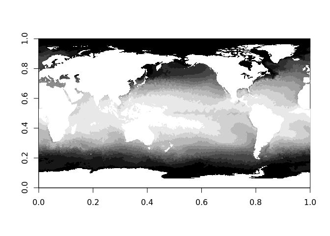
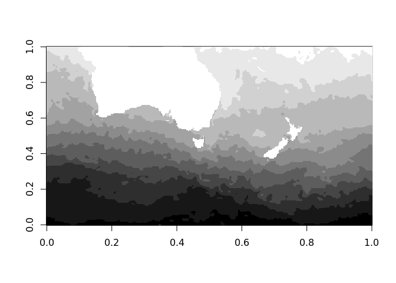
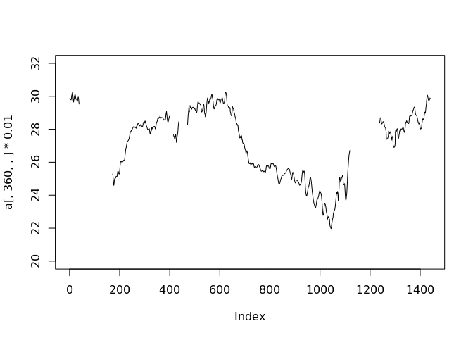
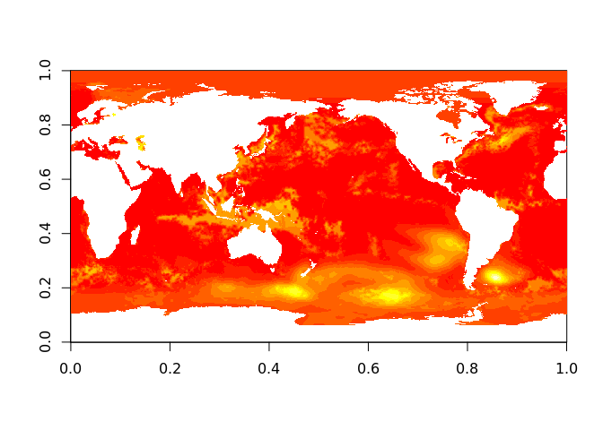
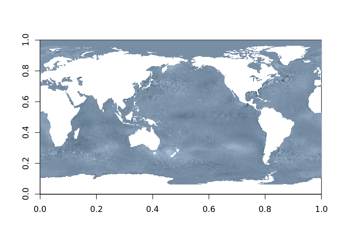

<!-- README.md is generated from README.Rmd. Please edit that file -->
[](https://www.tidyverse.org/lifecycle/#experimental) [](https://travis-ci.org/mdsumner/nchelper) [](https://travis-ci.org/mdsumner/nchelper) [](https://ci.appveyor.com/project/mdsumner/nchelper)

nchelper
========

The goal of nchelper is to provide NetCDF variables as R arrays.

Installation
------------

You can install nchelper from GitHub with:

``` r
# install.packages("devtools")
devtools::install_github("mdsumner/nchelper")
```

Example
-------

This is an example that reads an inbuilt data set of sea surface temperature.

First, find the file and open the variable "sst" as object `a`.

``` r
library(nchelper)
f <- system.file("extdata", "avhrr-only-v2.20180126.nc", package = "nchelper")
a <- nchelper(f, "sst")
dim(a)
#> [1] 1440  720    1    1
names(a)
#> [1] "sst"
```

Now use standard indexing idioms to extract data from this 4D array.

``` r
grcol <- grey(seq(0, 1, length.out = 12))
image(a[,,,], col = grcol)
```



``` r
image(a[400:800, 100:300,,], col = grcol)
```



``` r
plot(a[,360,,] * 0.01, ylim = c(20, 32), type = "l")
```



(Even though we asked for the variable "sst", we could have left it empty for a reminder about any available names.)

``` r
a <- nchelper(f)
#> Warning in nchelper(f): no varname specified, returning time
#>  choose varname from time,zlev,lat,lon,sst,anom,err,ice
a[]
#> [1] 14635
names(a)
#> [1] "time"

## so we go for one of the 2D ones (sst, anom, err, ice)
err <- nchelper(f, "err")
image(err[,,,])
```



This is a cheap and easy way to investigate the contents of a source.

``` r
image(nchelper(f, "anom")[,,,], col = hcl(240, c = 25, l = 10:90))
```

 Please note that this project is released with a [Contributor Code of Conduct](CODE_OF_CONDUCT.md). By participating in this project you agree to abide by its terms.
